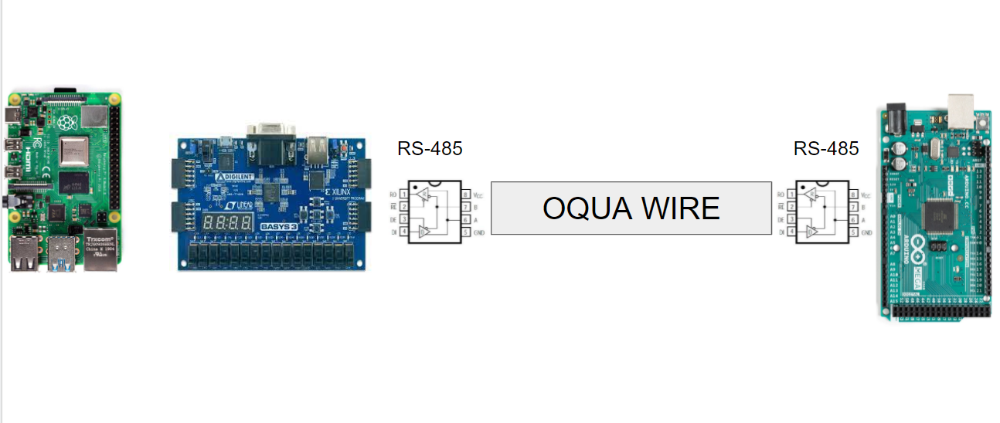

# RPI_SPI

Script to test the SPI pins of the RPI (can be used with the FPGA board)

https://github.com/raspberrypi/documentation/blob/develop/documentation/asciidoc/computers/raspberry-pi/spi-bus-on-raspberry-pi.adoc

## Planned:

- [ ] Integrate with manualTransmission-complete
- [x] Verify signal on both ends of wire
- [ ] Verify 8b10b

